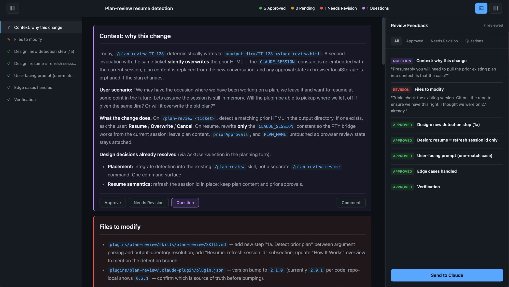
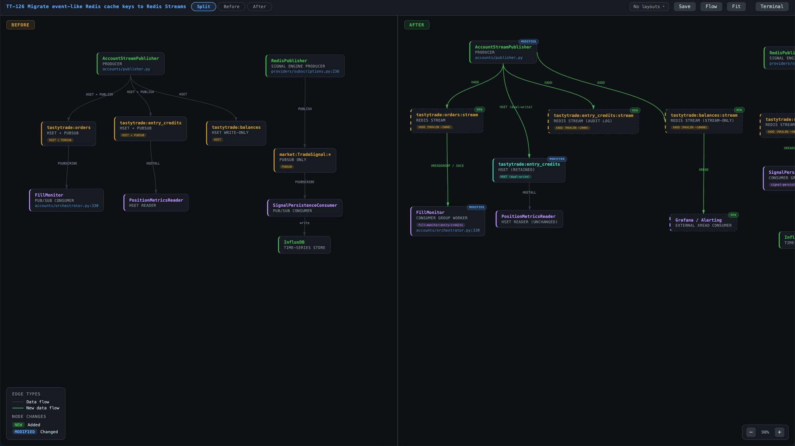
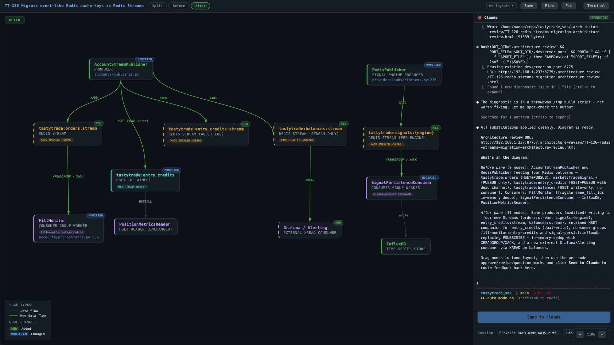
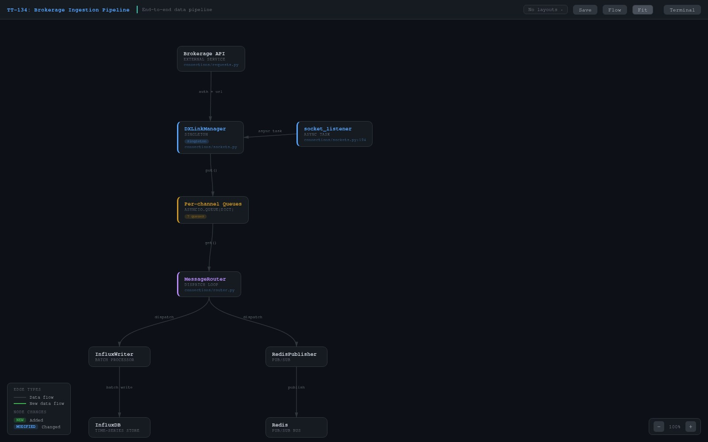

# Ship, Don't Slop
### Review plugins for Claude Code
> Observable checkpoints for agentic software delivery — so agents ship production code, not slop.

## Why

An observable, spec-driven agentic delivery workflow — **spec → architecture review → implementation** — built to reliably ship production code from agents. The premise: "AI slop" is a context-alignment problem, not a model limitation. Give the human a real review surface at each checkpoint and the agent keeps tracking reality.

Every plugin here runs the same pattern. You launch it from a local Claude Code terminal; it spins up a local HTTP server in the background and hands the active Claude session off into a browser page. You review, annotate, and send structured feedback back into the same running session — no copy-paste, no context drift, no fresh chat that forgot what you were doing.

---

## Quick Start

```text
/plugin marketplace add xmandeng/claude-plugins
/plugin install <plugin-name>@xmandeng-plugins
```

---

## Plugins

### `plan-review`

Interactive HTML review playgrounds for implementation plans. Every section becomes an independently reviewable unit — approve, flag for revision, or ask a question. Review state persists across reloads.



Click **Send to Claude** and the feedback bundle streams into an embedded `claude --resume <authoring-session-id>` PTY running inside the page. The session id is baked into the HTML at generation time — you always reconnect to the exact conversation that authored the plan.


- **Install:** `/plugin install plan-review@xmandeng-plugins`
- **Invoke:** `/plan-review [<ticket>]`
- **Docs:** [`plugins/plan-review/`](./plugins/plan-review/)

### `architecture-review`

Interactive before/after component diagrams. Split view puts the old architecture on the left, the new one on the right — drag nodes to clarify flow and save the arrangement as a named layout that persists to disk next to the HTML.



Review each node — approve, revise, or question with a comment — and send the bundle back to the same Claude session that drew the diagram, so you iterate in place.



- **Install:** `/plugin install architecture-review@xmandeng-plugins`
- **Invoke:** `/architecture-review [<ticket>]`
- **Docs:** [`plugins/architecture-review/`](./plugins/architecture-review/)

### `architecture-map`

Interactive single-view concept map of an application, seeded from conversation context. Draggable node graph with layered filters, per-node insights attributed to their authors, saved named layouts, and per-node feedback pins.



Click a node to see the design rationale — each author (you, Claude, a collaborator) gets a distinct color, so the *why* is always visible alongside the *what*.


- **Install:** `/plugin install architecture-map@xmandeng-plugins`
- **Invoke:** `/architecture-map [<ticket>]`
- **Docs:** [`plugins/architecture-map/`](./plugins/architecture-map/)

---

## Coming Soon

- **`pr-prep`** — draft the PR body, test plan, and risk notes in the session that built the feature, reviewed section-by-section so it's reviewer-ready before it hits GitHub.

More ideas welcome — [open an issue](https://github.com/xmandeng/claude-plugins/issues).

## License

MIT — see [LICENSE](LICENSE).
