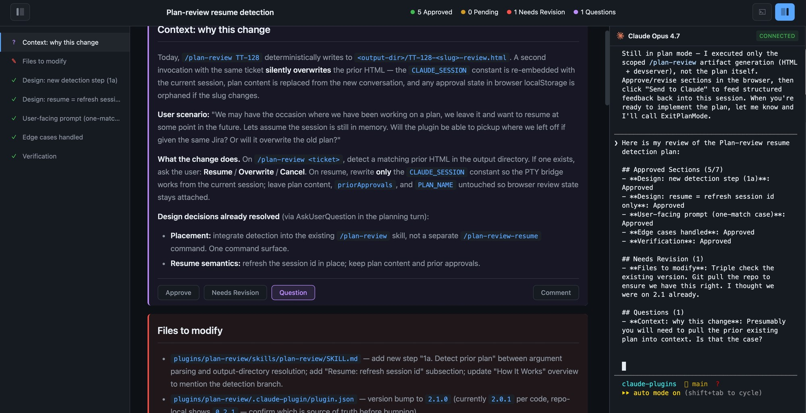
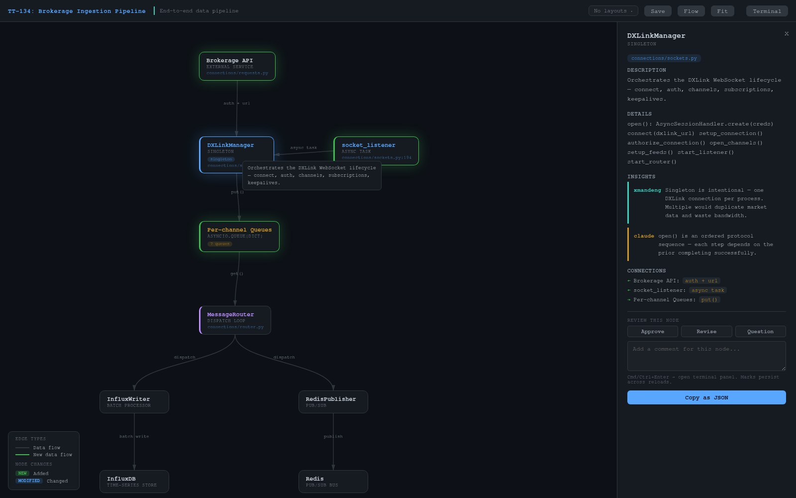

# Ship, Don't Slop
> Observable checkpoints for agentic software delivery — so agents ship production code you'd actually merge.

## Why

An observable, spec-driven agentic delivery workflow — **spec → architecture review → implementation** — built to reliably ship production code from agents. The premise: "AI slop" is a context-alignment problem, not a model limitation. Give the human a real review surface at each checkpoint and the agent keeps tracking reality.

Every skill here runs the same pattern. You launch it from a local Claude Code terminal; it spins up a local HTTP server in the background and hands the active Claude session off into a browser page. You review, annotate, and send structured feedback back into the same running session — no copy-paste, no context drift, no fresh chat that forgot what you were doing.

---

## Quick Start

```text
/plugin marketplace add xmandeng/claude-plugins
/plugin install review-suite@xmandeng-plugins
```

That single install gives you all five skills below — sharing one devserver binary and one PTY bridge.

---

## review-suite

One plugin, five slash commands. The three review/map skills generate interactive HTML playgrounds and bridge browser feedback back into your Claude session via an embedded `claude --resume <sid>` PTY. The remaining two are utilities.

### `/plan-review [<ticket>]`

Interactive HTML review playgrounds for implementation plans. Every section becomes an independently reviewable unit — approve, flag for revision, or ask a question. Review state persists across reloads.


Click **Send to Claude** and the feedback bundle streams into an embedded `claude --resume <authoring-session-id>` PTY running inside the page. The session id is baked into the HTML at generation time — you always reconnect to the exact conversation that authored the plan.



### `/architecture-review [<ticket>]`

Interactive before/after component diagrams. Split view puts the old architecture on the left, the new one on the right — drag nodes to clarify flow and save the arrangement as a named layout that persists to disk next to the HTML.


Review each node — approve, revise, or question with a comment — and send the bundle back to the same Claude session that drew the diagram, so you iterate in place.


### `/architecture-map [<ticket>]`

Interactive single-view concept map of an application, seeded from conversation context. Draggable node graph with layered filters, per-node insights attributed to their authors, saved named layouts, and per-node feedback pins.


Click a node to see the design rationale — each author (you, Claude, a collaborator) gets a distinct color, so the *why* is always visible alongside the *what*.



### `/code-diagram [<scope>]`

Generates a Graphviz `.dot` source plus rendered SVG/PNG/PDF for call graphs, class models, dependency graphs, and component/process diagrams. The agent picks the graph shape that fits the material rather than pre-committing to one layout, then renders through the local `dot` utility. Useful for solidifying mental models of unfamiliar code before review.

### `/devserver [port]`

Starts (or reuses) the bundled devserver from your project root, so you can browse generated playground HTML files without first invoking a review skill. Picks the first free port in 8765–8799, persists it to `.plan-review/.devserver-port` for reuse across invocations.

---

## Docs

Full per-skill documentation, the canonical devserver source, hooks, and tests live under [`plugins/review-suite/`](./plugins/review-suite/).

---

## Ideas welcome

[Open an issue](https://github.com/xmandeng/claude-plugins/issues) if there's a checkpoint in your delivery flow that would benefit from the same review-and-resume pattern.

## License

MIT — see [LICENSE](LICENSE).
