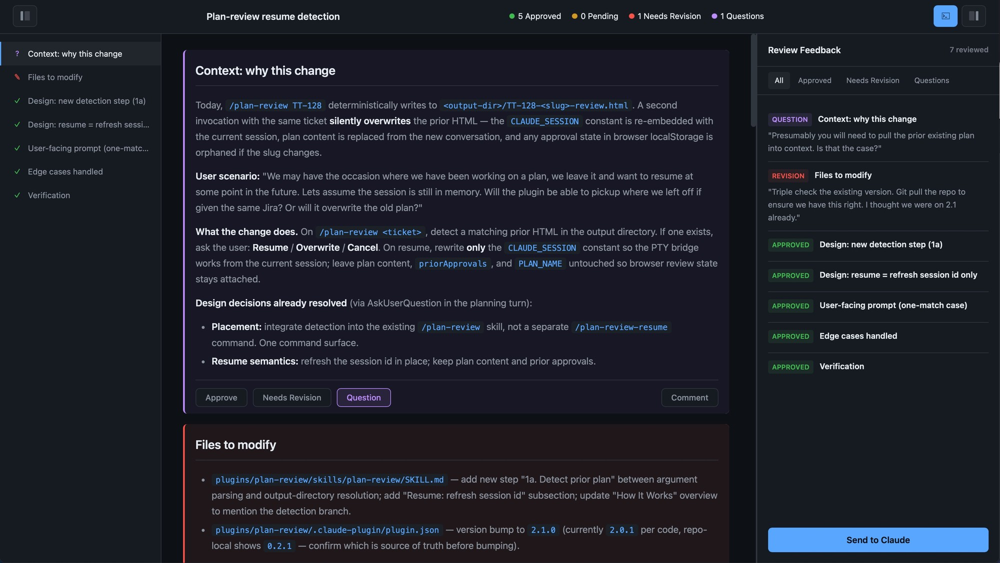
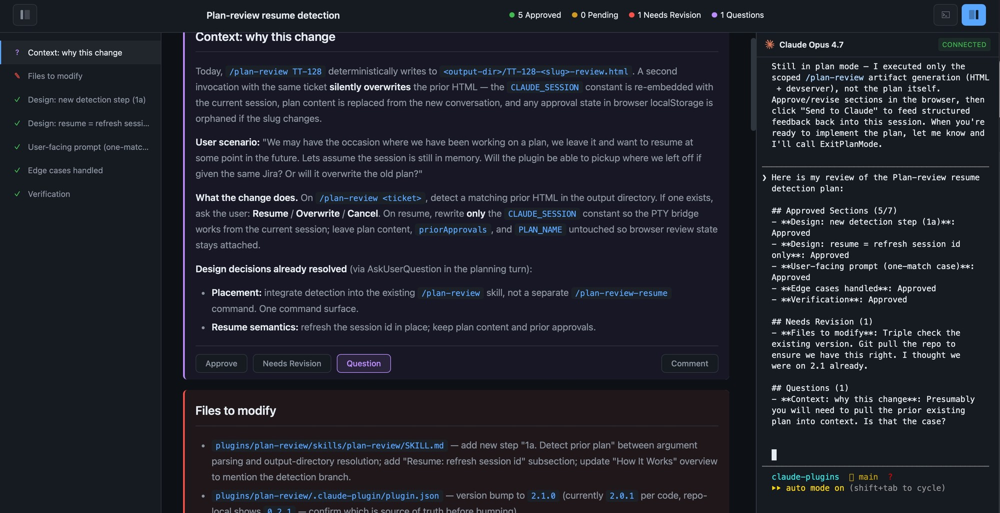
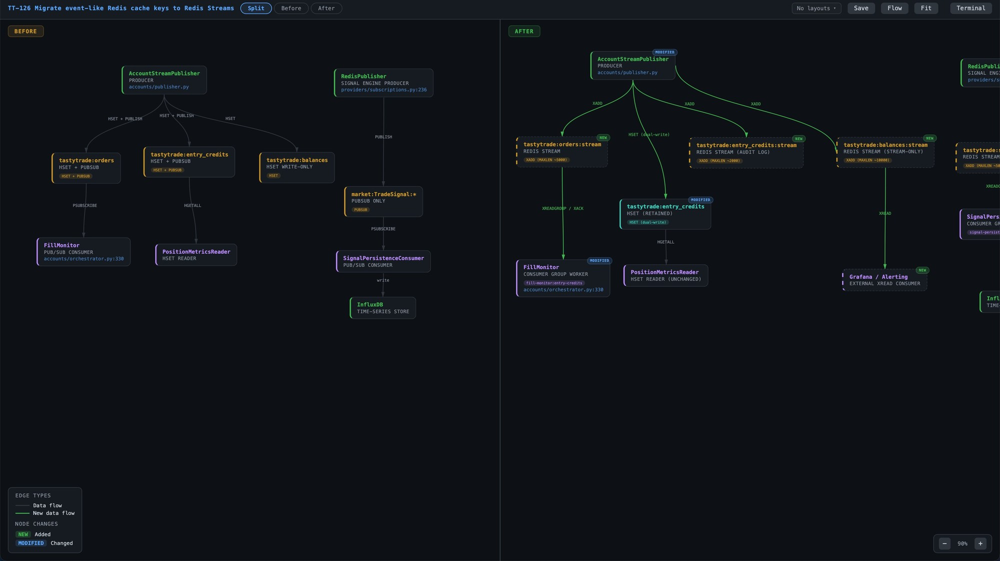
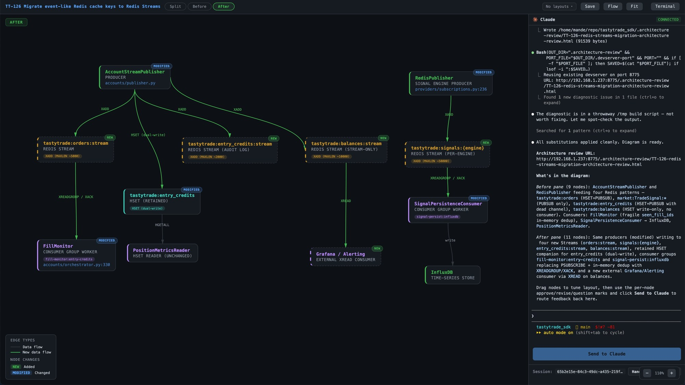
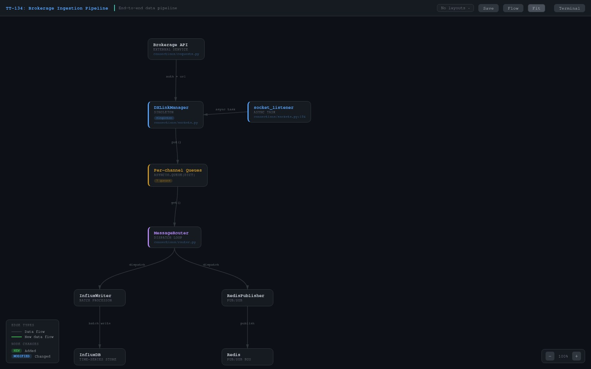
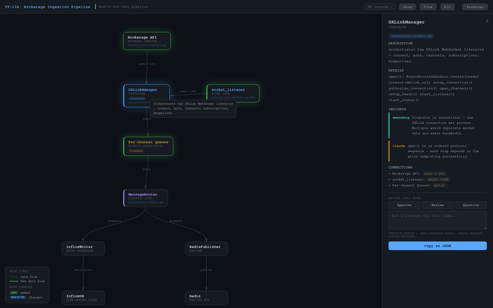
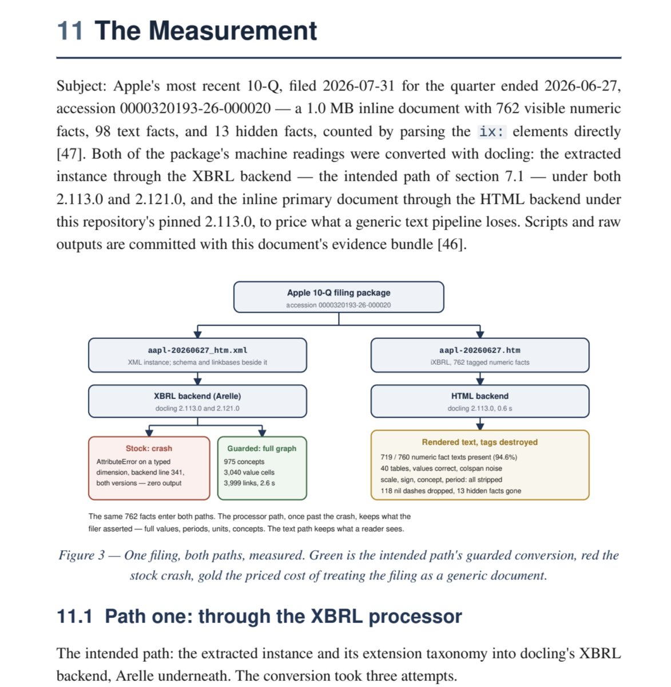

# Ship, Don't Slop
> Observable checkpoints for agentic software delivery — so agents ship production code you'd actually merge.

## Why

An observable, spec-driven agentic delivery workflow — **spec → design review → implementation** — built to reliably ship production code from agents. The premise: "AI slop" is a context-alignment problem, not a model limitation. Give the human a real review surface at each checkpoint and the agent keeps tracking reality.

The review skills share one pattern. You launch a skill from a local Claude Code terminal. It starts a local HTTP server in the background and opens the active Claude session in a browser page. You review, annotate, and send structured feedback back into the same running session: no copy-paste, no context drift, no fresh chat that forgot what you were doing.

When a design is settled, the `textbook` plugin typesets it as a PDF reference you can read on a tablet.

---

## Quick Start

```text
/plugin marketplace add xmandeng/claude-plugins
/plugin install review-suite@xmandeng-plugins
/plugin install textbook@xmandeng-plugins
```

| Plugin | What it gives you |
|---|---|
| [`review-suite`](#review-suite) | Five skills for interactive review playgrounds and diagrams, sharing one devserver and one PTY bridge |
| [`textbook`](#textbook) | Polished PDF engineering references, sized for a reMarkable or iPad |

To pick up new versions later, run `/plugin marketplace update xmandeng-plugins`, then `/plugin update <plugin>`.

---

## review-suite

One plugin, five slash commands. The three review/map skills generate interactive HTML playgrounds and bridge browser feedback back into your Claude session via an embedded `claude --resume <sid>` PTY. The remaining two are utilities.

### `/plan-review [<ticket>]`

Interactive HTML review playgrounds for implementation plans. Every section becomes an independently reviewable unit — approve, flag for revision, or ask a question. Review state persists across reloads.



Click **Send to Claude** and the feedback bundle streams into an embedded `claude --resume <authoring-session-id>` PTY running inside the page. The session id is baked into the HTML at generation time — you always reconnect to the exact conversation that authored the plan.



### `/design-review [<ticket>]`

Interactive before/after component diagrams. Split view puts the old architecture on the left, the new one on the right — drag nodes to clarify flow and save the arrangement as a named layout that persists to disk next to the HTML.



Review each node — approve, revise, or question with a comment — and send the bundle back to the same Claude session that drew the diagram, so you iterate in place.



### `/architecture-map [<ticket>]`

Interactive single-view concept map of an application, seeded from conversation context. Draggable node graph with layered filters, per-node insights attributed to their authors, saved named layouts, and per-node feedback pins.



Click a node to see the design rationale — each author (you, Claude, a collaborator) gets a distinct color, so the *why* is always visible alongside the *what*.



### `/code-diagram [<scope>]`

Generates a Graphviz `.dot` source plus rendered SVG/PNG/PDF for call graphs, class models, dependency graphs, and component/process diagrams. The agent picks the graph shape that fits the material rather than pre-committing to one layout, then renders through the local `dot` utility. Useful for solidifying mental models of unfamiliar code before review.

### `/devserver [port]`

Starts (or reuses) the bundled devserver from your project root, so you can browse generated playground HTML files without first invoking a review skill. Picks the first free port in 8765–8799, persists it to `.plan-review/.devserver-port` for reuse across invocations.

---

## textbook

Turns technical content (a design, a plan, a subsystem explainer, a research report) into a typeset PDF engineering reference. It includes a title page, a linked contents page, numbered sections, navy-header tables, callouts, dark code blocks, and inline SVG diagrams. Claude writes the document as HTML against a fixed stylesheet and renders it with WeasyPrint in a throwaway `uv` environment. It then reads the rendered pages back to check them before delivering.

<table>
  <tr>
    <td width="50%"></td>
    <td width="50%"></td>
  </tr>
  <tr>
    <td align="center"><sub>Title page</sub></td>
    <td align="center"><sub>Body page: numbered section, cited sources, inline SVG figure</sub></td>
  </tr>
</table>

Pages are 158 x 210 mm, the 4:3 shape of a reMarkable 2 screen, which also suits a 13" iPad and fits an 11" iPad by width. The page shows at about its printed size, so the 11.5pt body text reads without zooming or pinching. Contents entries and PDF bookmarks jump to their section. One line in the document switches it to A4 for paper.

Every draft goes through two subagent passes before rendering:

1. A rules editor enforces a plain, lead-with-the-point prose style and a list of banned words.
2. A topic-blind reader flags every place a newcomer would stall.

Ask for "a textbook" or "a PDF reference" of whatever you just designed. Requires `uv` and WeasyPrint's native libraries (pango, cairo, harfbuzz).

---

## Docs

Full documentation lives with each plugin: [`plugins/review-suite/`](./plugins/review-suite/) (per-skill docs, the devserver source, hooks, and tests) and [`plugins/textbook/`](./plugins/textbook/) (the skill, stylesheet, template, and diagram patterns).

---

## Ideas welcome

[Open an issue](https://github.com/xmandeng/claude-plugins/issues) if there's a checkpoint in your delivery flow that would benefit from the same review-and-resume pattern.

## License

MIT — see [LICENSE](LICENSE).
