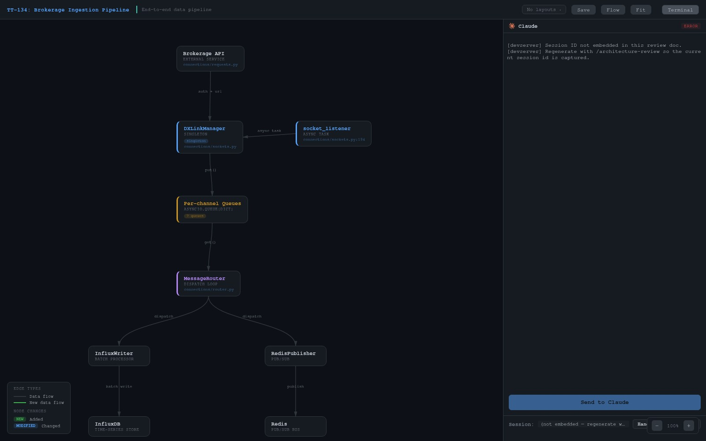

# architecture-map

Interactive architecture concept-map playground. Chat-seeded draggable node graph with layered filters, per-node insights, saved named layouts, per-node feedback pins, and a Send-to-Claude button that drives a live Claude Code session via an embedded terminal.

Positioned alongside its sibling plugins:

| Plugin | Output | When to use |
|---|---|---|
| `plan-review` | Section-by-section plan review | Approving an implementation plan |
| `architecture-review` | **Before/after** diagram for a proposed change | Reviewing an architecture diff |
| **`architecture-map`** | **Single-view** concept map of a system | Mapping an existing application end-to-end |

## How It Feels

**Discuss the system, get a map.** After a design conversation or a code-reading session, run `/architecture-map`. The authoring Claude session distills the discussion into nodes, edges, layers, and insights and emits a self-contained HTML playground.


**Click a node, see the why.** The detail panel surfaces description, code snippet, connections, and — most importantly — **insights**: the design rationale baked into the map by the authoring session. Each author (you, Claude, a collaborator) gets a distinct color. This is what turns it from a block diagram into a concept map.


**Approve, flag, ask — per node.** The same pin model as `architecture-review`: green approve, red revise, purple question, plus a free-text comment. Marks persist in `localStorage`, so reload-safe.

**Send the bundle to Claude.** Your structured node feedback streams into an embedded `claude --resume <authoring-session-id>` PTY running inside the page. The session id is baked into the HTML at generation time, so you always reconnect to the exact conversation that authored the map.



**Resume, don't overwrite.** Re-run `/architecture-map <ticket>` a week later and the plugin detects the prior HTML. Pick **Resume** — the nodes/edges/insights hydrate back into the agent's context; only the embedded session id refreshes. Your previous node pins and saved layouts stay attached.

## How It Works

You invoke `/architecture-map` from a local Claude Code terminal. The plugin asks the authoring session to distill the current conversation into a node graph (layers, nodes, edges, insights), substitutes the result into a bundled HTML template, spins up a local HTTP + websocket devserver in the background, and returns a URL on your LAN. Open it on any device on your network: the page mounts an xterm.js terminal that websockets back to the devserver, which spawns `claude --resume <authoring-session-id>` in a PTY. Your active Claude session has effectively been handed off into the browser — the feedback you click is the feedback Claude sees.

## Install

```
/plugin marketplace add xmandeng/claude-plugins
/plugin install architecture-map@xmandeng-plugins
```

## Quick Start

From any Claude Code session where you've discussed an application or subsystem:

```
/architecture-map TT-134
```

You get a generated concept-map HTML, a devserver on your LAN IP, and a URL to open on any device on your network. Invoke with no argument to infer the ticket + scope from conversation context.

**Scoping from chat** — if the conversation names a scope ("map only the ingestion path", "map the auth service and its consumers"), the authoring session honors it and displays the applied scope in the topbar. End-to-end is the default.

## Authoring Model

Nodes are authored by the Claude session from conversation context. The schema mirrors the source playground's:

- `id` (required) — unique, used in edges
- `x`, `y` (required) — initial position on canvas; user can drag
- `layer` (required) — free-form layer name; pill color is auto-assigned
- `label`, `type` (required) — component name + subtitle
- `desc` (required) — one-line description
- `file`, `details`, `code`, `badge`, `note` (optional)
- `insights` (optional) — array of `{author, text}` design/analysis notes; authors get auto-assigned colors
- `connections` (required) — ids of connected nodes (highlights them on detail open)

Edges: `{from, to, label?, style?}` — `style: 'dashed'` for out-of-band flows (callbacks, async tasks).

See [skills/architecture-map/SKILL.md](./skills/architecture-map/SKILL.md) for the full authoring workflow, node layout guidelines, and scope-header conventions.

## Configuration

| Variable | Default | Purpose |
|---|---|---|
| `ARCHITECTURE_MAP_DIR` | `.architecture-map/` | Output directory for generated HTML |
| `ARCHITECTURE_MAP_HOST` | auto-detected LAN IP | Override the host in the returned URL |
| `ARCHITECTURE_MAP_PORT` | `8785` | Preferred devserver port (scan starts here) |

Default preferred port 8785 — `plan-review` uses 8765, `architecture-review` uses 8775 — so all three plugins can run side-by-side in one project without fighting for ports. Port allocation scans upward on collision.

## License

MIT.
