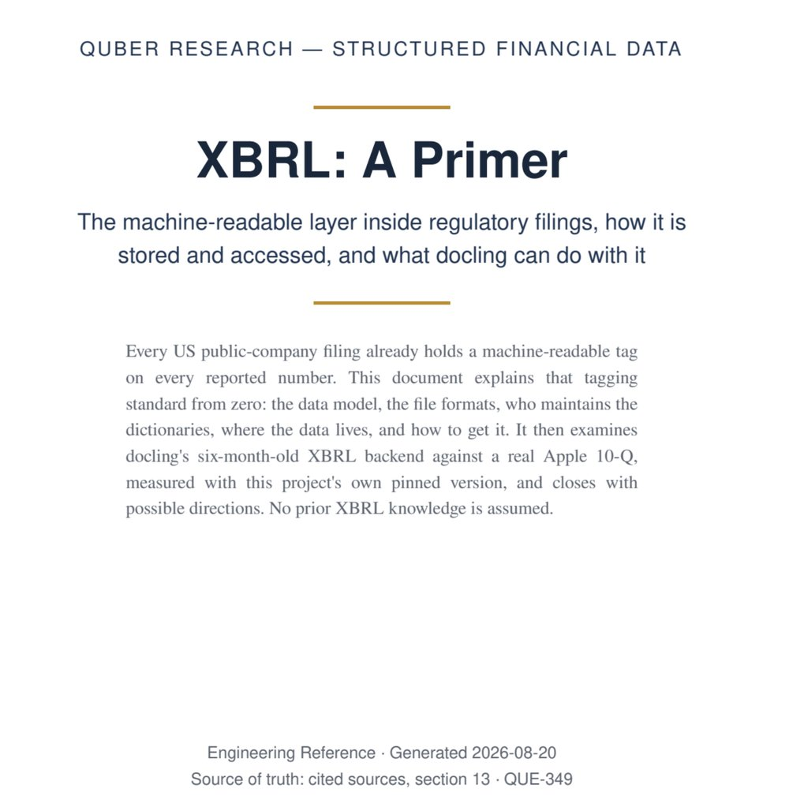
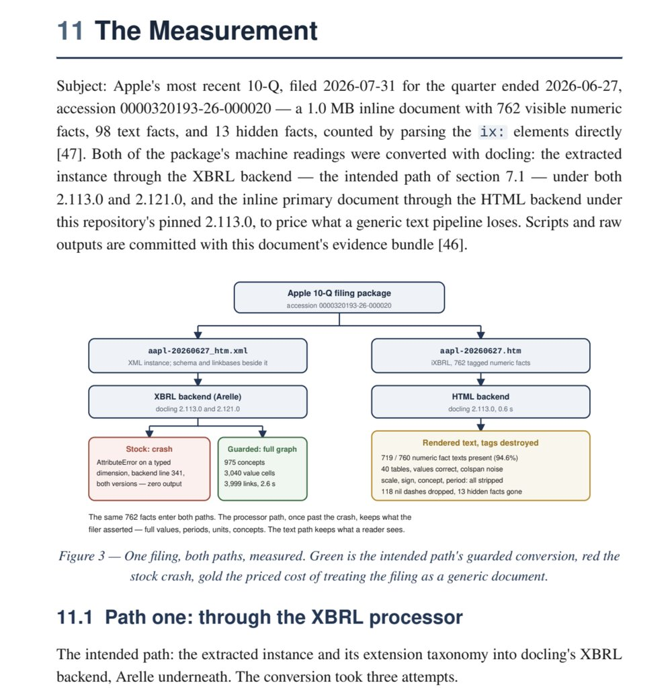

# textbook

Turns technical content (a design, a plan, a subsystem explainer, a research report) into a polished PDF engineering reference. Claude writes the document as HTML against a fixed stylesheet, renders it with WeasyPrint, and checks the rendered pages before handing over the PDF.

<table>
  <tr>
    <td width="50%"></td>
    <td width="50%"></td>
  </tr>
  <tr>
    <td align="center"><sub>Example title page</sub></td>
    <td align="center"><sub>Example body page</sub></td>
  </tr>
</table>

## What you get

- A title page, and a contents page whose entries are links with page numbers
- Numbered sections, justified serif body text, navy-header tables
- Callouts for notes, warnings, and cited sources, plus dark code blocks
- Inline SVG diagrams from four patterns: pipeline, before/after, two-outcome branch, timeline
- PDF bookmarks for every section

## Sized for tablets and e-readers

Pages are 158 x 210 mm, the 4:3 shape of a reMarkable 2 screen. A reMarkable Paper Pro and a 13" iPad share that shape, and an 11" iPad fits it by width. The device shows the page at about its printed size, so the 11.5pt body text reads without zooming or pinching.

For paper, add `<style>@page { size: A4; margin: 2cm; }</style>` to the document's `<head>`.

## Writing rules

The skill applies a set of prose rules learned from real document reviews: lead with the point, define things concretely, one idea per sentence, no metaphors standing in for mechanisms. It also enforces a list of banned words. Every draft goes through two subagent passes before rendering:

1. A rules editor tightens the prose.
2. A topic-blind reader reports every place a newcomer would stall.

Research reports add their own rules: findings ranked by evidence, cited sources, and measured numbers rather than recalled ones.

## Usage

Ask for a "textbook", a PDF reference, or a document to read on your tablet:

```text
/textbook:textbook
> Make a textbook of the ingestion pipeline design we just reviewed.
```

Output goes to `docs/<NAME>.pdf` unless you name another path.

## Prerequisites

- [`uv`](https://docs.astral.sh/uv/) on PATH. WeasyPrint runs in a throwaway environment, so nothing is installed into your project.
- WeasyPrint's native libraries: pango, cairo, harfbuzz (`apt install libpango-1.0-0 libpangoft2-1.0-0 libharfbuzz0b` on Debian/Ubuntu).
- Nimbus or Liberation fonts (usually preinstalled on Linux; `apt install fonts-liberation` otherwise).
